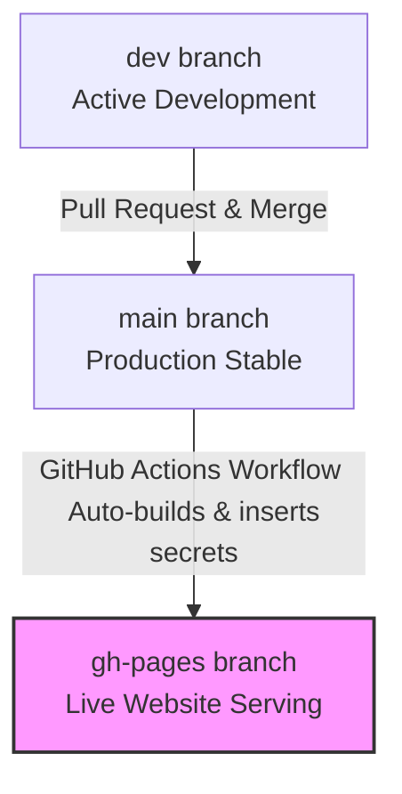

# Gyanoday Vidyalaya Git & Deployment Guide

This guide explains the branch hierarchy for your project and shows you how to safely commit, push, and deploy your newly updated Admin Panel code.

---

## 🌳 Branch Hierarchy & Roles

Here is how your three branches work:



1. **`dev` (Development)**: **Always write code here first.** This is where your active features, theme adjustments, and admin fixes are built and tested.
2. **`main` (Production)**: This contains your stable, release-ready code. Once features are fully tested on `dev`, you merge them into `main`.
3. **`gh-pages` (Deployment)**: **Do not commit directly here.** This branch is automatically overwritten by GitHub Actions. Every time you push to `main`, GitHub Actions runs your build script, inserts your secure Firebase API keys, and publishes the results to `gh-pages` for hosting.

> [!WARNING]
> **Never commit directly to the `gh-pages` branch.** If you do, any changes you save there will be **permanently overwritten and deleted** during the next automated deployment from `main`.

---

## 🛠️ Step-by-Step Deployment Instructions

Since your changes were made while your local repository was pointing to `gh-pages`, follow these exact steps to transfer and deploy your changes safely:

### Step 1: Transfer Changes to `dev`
Keep your modified files safe, switch to the development branch, and apply the modifications:

```powershell
# 1. Temporarily save your uncommitted changes
git stash

# 2. Switch to your development branch
git checkout dev

# 3. Apply your changes onto the dev branch
git stash pop
```

---

### Step 2: Commit and Push to `dev`
Now stage your changes, commit them with a clean message, and push them to your remote GitHub repository:

```powershell
# 1. Stage the modified files
git add admin/dashboard.html admin/js/admin-app.js

# 2. Commit the changes
git commit -m "feat: enhance admin panel with upload buttons, icon suggestions, and youtube URL guides"

# 3. Push development branch to GitHub
git push origin dev
```

---

### Step 3: Deploy to Production (`main`)
To update your live website, merge your tested `dev` branch into your `main` branch and push it:

```powershell
# 1. Switch to the main branch
git checkout main

# 2. Pull the latest main from GitHub to make sure you are up-to-date
git pull origin main

# 3. Merge your dev changes into main
git merge dev

# 4. Push to main to trigger the automated GitHub Actions deployment
git push origin main
```

Once pushed, your GitHub Actions workflow will instantly kick off, compile your files, inject your Firebase API keys, and deploy the updated code to `gh-pages`. Your live website at `gyanodayvidyalaya.com` will update in just a couple of minutes!
